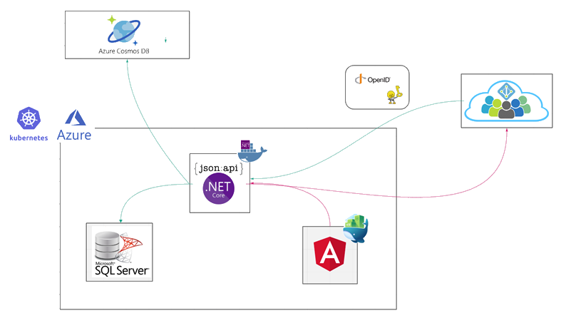
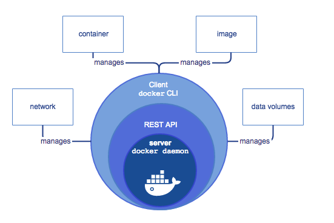
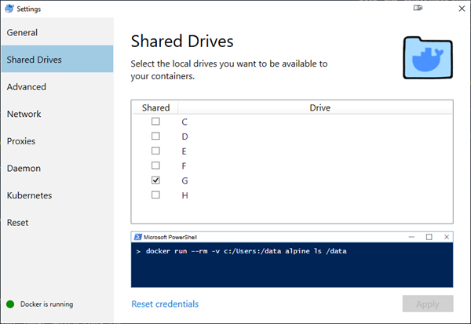

# Docker

## Installation

---

### Install Docker with Linux Containers on Windows Server 2019

---

```auto
Install-WindowsFeature -Name Hyper-V -ComputerName <computer_name> -IncludeManagementTools -Restart

Install-Module DockerProvider -Force

Install-Package Docker -ProviderName DockerProvider -RequiredVersion preview
```

#### Switch to Linux Containers

```auto
[Environment]::SetEnvironmentVariable("LCOW_SUPPORTED", "1", "Machine")

Restart-Service docker
```

#### Switch to Windows Containers

```auto
[Environment]::SetEnvironmentVariable("LCOW_SUPPORTED", $null, "Machine")

Restart-Service docker
```

#### Test Windows Containers

docker container run hello-world:nanoserver

---

### Install Docker on Windows 10

Download & Install from: `https://hub.docker.com/editions/community/docker-ce-desktop-windows`

---

## Docker Basic Commands

---

Download an Image

`docker pull microsoft/mssql-server-linux:latest`

### Base Switches & Things to know

Detached: `-d`

Cleanup: `--rm`

Map Ports `LocalPort:DockerPort` : `--p 8080:5000`

Mount Containers to allow Network Communication: `--link sqllinux:sqllinux`

Prefexing prod keeps Intellisense in file and allows you to have more than one Dockerfile. Example:

`Dockerfile` or `anguarui.dockerfile`

---

## Containerize a 3-Tier Application

---



Hosting



### Run SQL for Linux in Container

---

`docker run -d --name sqllinux -e 'ACCEPT_EULA=Y' -e 'SA_PASSWORD=TiTp4SQL@dmin' microsoft/mssql-server-linux:latest`

Show running containers: `docker ps -a`

---

### Containerize .NET Core Web Api

Execute in `..\13 Publishing\VouchersAPI\VouchersAPI\`

---

Specify Dockerfile for Build: -f ... Dockerfile | prod.dockerfile

Adjust Connection String:

`"DockerConnection": "Data Source=sqllinux;Initial Catalog=VoucherDockerDB;;User ID=sa;Password=TiTp4SQL@dmin"`

```
docker build --rm -f "Dockerfile" -t vouchersapi:latest .
docker run -d --rm -p 8080:8080 --link sqllinux:sqllinux vouchersapi:latest
```

---

### Containerize Angular Frontend

---

[NGINX](https://www.nginx.com/) is a commonly used Web Server to serve static Apps like Angular

Execute in `..\13 Publishing\VouchersUI\`

### Check NGINX image

Look at `/config/nginx.conf`

Execute

```
docker build -t vouchersui:1.0.0 -f app.dockerfile .
docker run -d -p 8080:80/tcp vouchersui
```

Check `http://localhost:8080` for result

---

#### Run Angular agains NGINX in watch mode

---

#### Run a Dev Build in Watch mode:

`ng build --prod`

##### Keep "dist"-folder when building:

`ng build --watch --delete-output-path false`

##### Build angular-nginx:

`docker build --rm -t vouchersui -f app.dockerfile .`

##### Run angular on nginx using mapped drive to build:

Use on Windows Host the mountend folder needs to be shared on Windows and "Shared Devices" needs to be enabled in Docker Desktop



Run & Map local `dist/vouchersui` folder as `html` to nginx

`docker run -d -p 8080:80 -v ${PWD}/dist/vouchersui:/usr/share/nginx/html vouchersui`

Use on Linux / Mac Host

`docker run -d -p 8080:80 -d -v $(pwd)/dist/vouchersui:/usr/share/nginx/html vouchersui`

Be aware that `nginx.conf` contains a route that redirects Server Side `404 errors` to Angular's `index.html` for Angular Routing to detect the route.

```
location / {
    try_files $uri $uri/ /index.html =404;
}
```

---

#### Create a Production Build:

---

docker build --rm -f "app.anguarui.dockerfile" -t vouchersui:latest .

---

## Using Docker Compose

[Docker Compose Cheatsheet](https://devhints.io/docker-compose)

Build your Network:

`docker-compose build`

Run Network

`docker-compose up`

# Kubernetes

## Setup

Download & Install [Minikube](https://kubernetes.io/docs/tasks/tools/install-minikube/)
